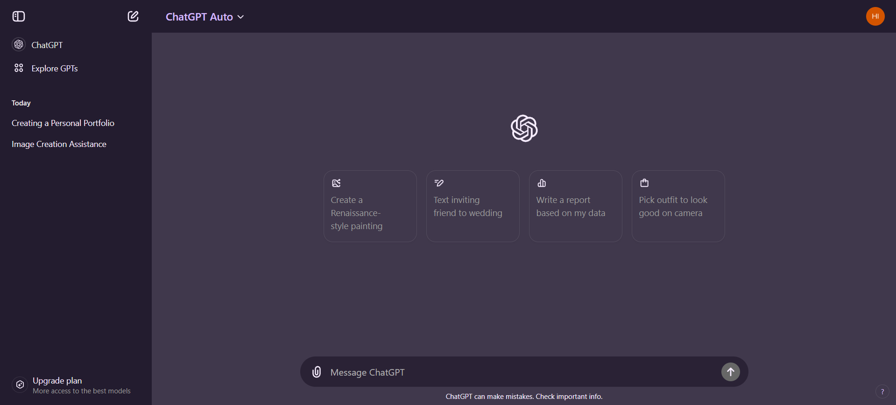
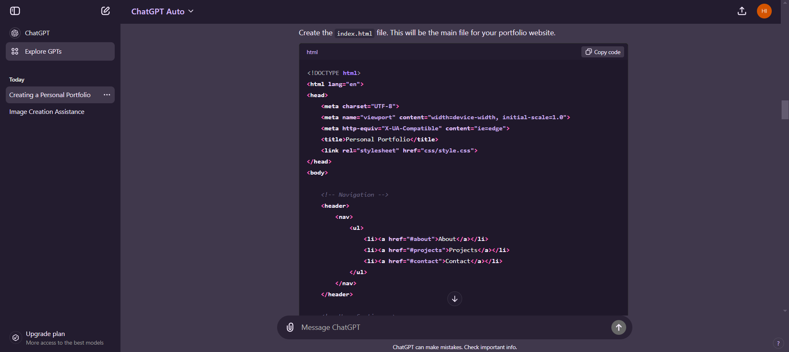
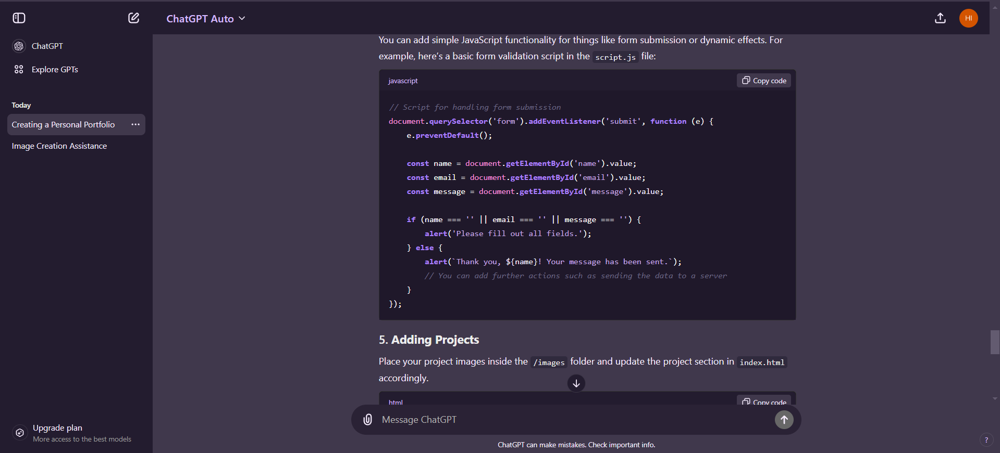
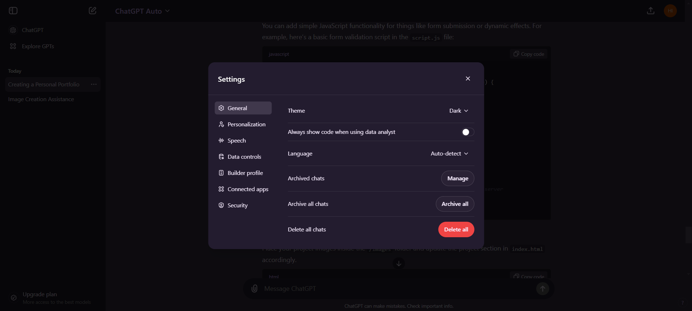

# Purple ChatGPT Theme

  

A custom theme for ChatGPT UI with a purple color scheme, designed to enhance the interface for dark mode users.

### Preview

---

## How to Set Up the Purple ChatGPT Theme

Follow these steps to apply the custom Purple ChatGPT theme to your ChatGPT interface:

### Step 1: Download the CSS File
Download the `PurpleChatGPT.css` file that contains all the styling rules for the theme.

### Step 2: Install the User CSS Extension
You need to install the **User CSS** extension to apply the custom styles to ChatGPT. You can get the extension from the Chrome Web Store by following this link:

[User CSS Extension on Chrome Web Store](https://chromewebstore.google.com/detail/okpjlejfhacmgjkmknjhadmkdbcldfcb)

### Step 3: Copy the CSS Code
After downloading the `PurpleChatGPT.css` file, open it and copy all the CSS code from the file.

### Step 4: Apply the Custom Theme
1. Navigate to the ChatGPT website: [https://chatgpt.com/](https://chatgpt.com/).
2. Make sure **Dark mode** is enabled on ChatGPT for the theme to work effectively.
3. Open the **User CSS Tool** from the browser extension you installed in Step 2.
4. Paste the copied CSS code into the User CSS Tool.
5. Enable the custom CSS to apply the theme.

### Step 5: Done!
Your custom purple theme for ChatGPT is now live! Enjoy the new look!

---

## Note
- This theme is optimized for Dark mode, so ensure it's enabled for the best experience.
- Feel free to tweak the CSS styles to better suit your personal preferences.

